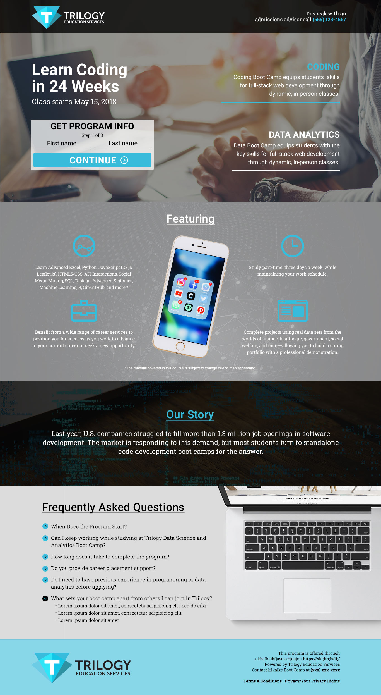
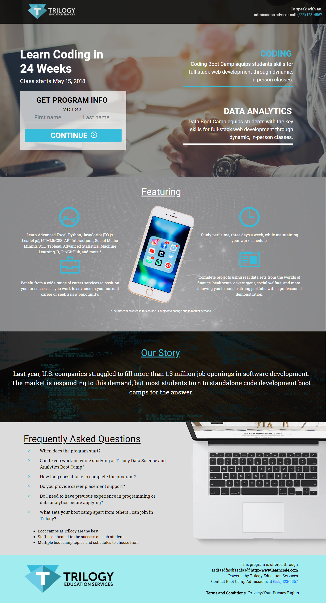

# Trilogy Education Service Website Mock-Up

Front-end web development of the Trilogy Education Service mock-up website @1366px wide view rapidly deployed, including design and graphic match-ups.

## Technologies Used:
* HTML/CSS
* SASS/SCSS
* JavaScript/jQuery

## Still Yet To Do:
* Mock-Up of website @480px wide view
* Make mobile site responsive

## Mock-up Screen Captures:
| Web Original (@1366px wide)                           | Web Mock-Up (@1366px wide)                          |
| :---------------------------------------------------: | :-------------------------------------------------: |
|  |  |

| Mobile Original (@480px wide)                        | Mobile Mock-Up (@480ps wide)                        |
| :--------------------------------------------------: | :-------------------------------------------------: |
|  |  |
